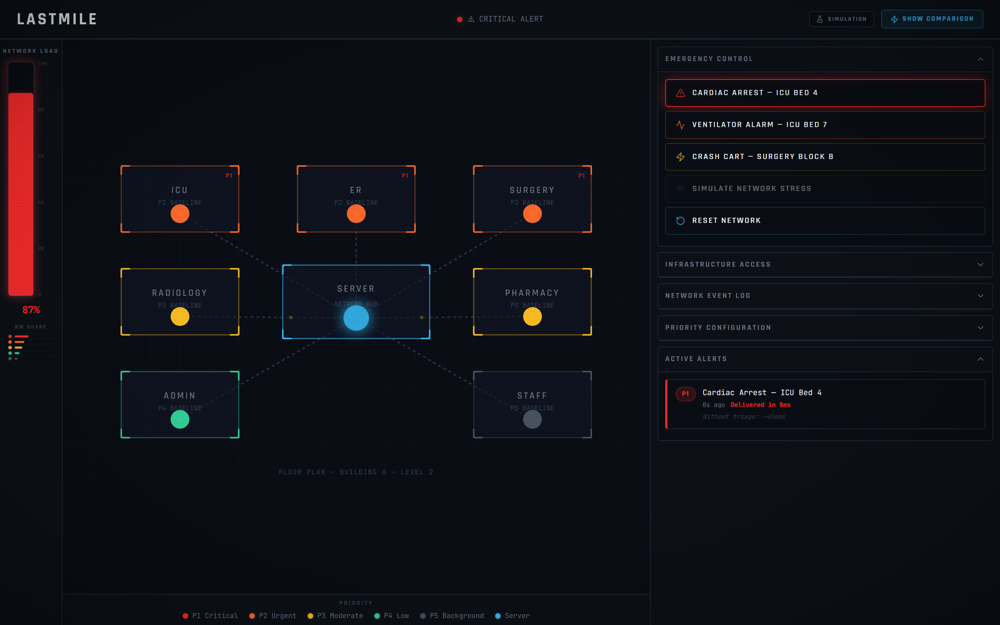
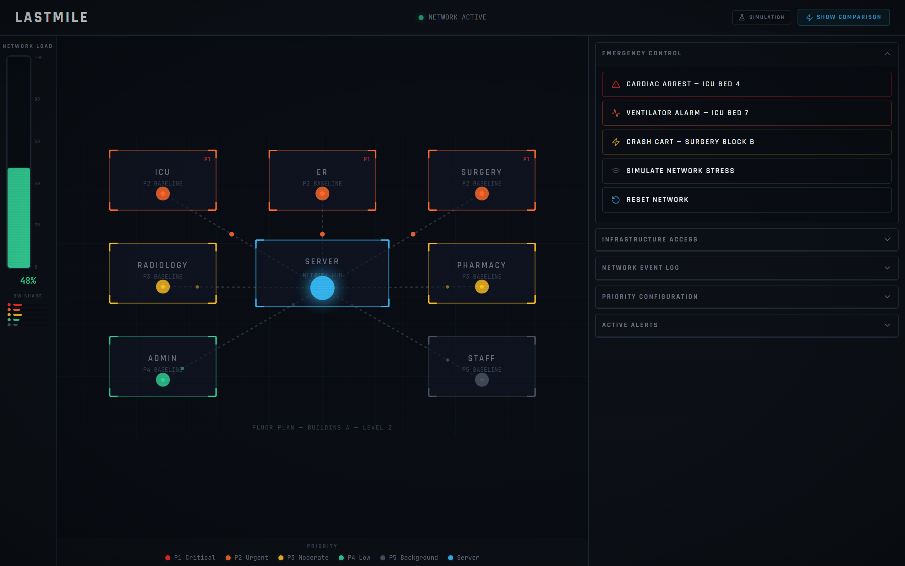
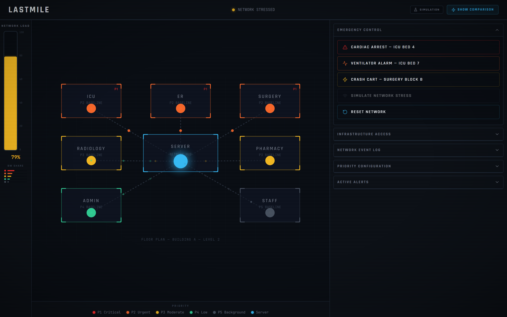
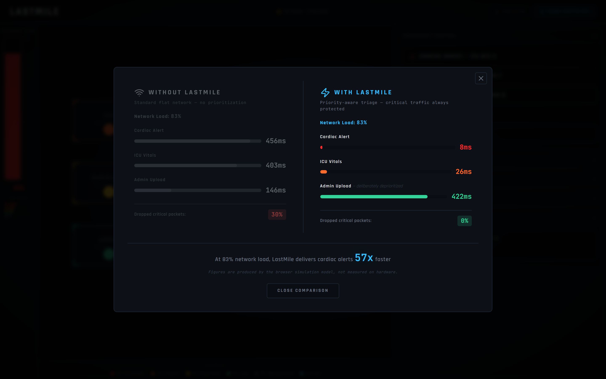
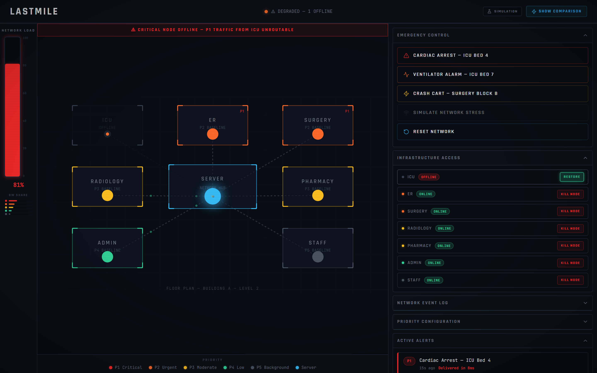
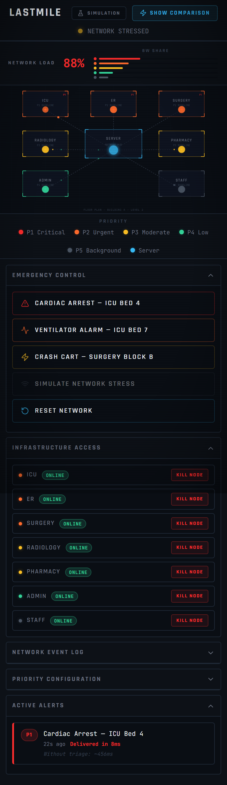

# LastMile Hospital Network Triage System

[](https://github.com/guru-bharadwaj20/LastMile-Hospital/actions/workflows/ci.yml)
[](LICENSE)
[](https://react.dev/)
[](https://vitejs.dev/)
[](https://www.python.org/)
[](https://opennetworking.org/sdn-resources/openflow/)

> *"Hospitals triage patients by urgency. LastMile triages packets the same way."*



<sub>A P1 cardiac alert crossing a network at 88% load. Background traffic is suspended, the alert reaches the server in single-digit milliseconds. All stills are generated by `npm run demo:capture` — see [docs/DEMO.md](docs/DEMO.md).</sub>

---

## The Problem

Every hospital runs a single shared network carrying wildly different types of traffic simultaneously. This includes cardiac arrest alerts, ventilator alarms, ICU vitals, X ray image transfers, pharmacy orders, administrative file uploads, and staff WiFi. On a conventional network, all of this traffic is treated equally. A life critical cardiac alert can get stuck behind a radiology image upload during peak hours.

When a network approaches saturation, queuing delay dominates end to end latency. In emergency medicine, that delay is clinically significant: the difference between a nurse receiving an alert in tens of milliseconds versus hundreds of milliseconds can determine whether intervention happens in time.

LastMile addresses this by making the hospital network behave like a hospital, prioritizing traffic exactly the way clinicians triage patients. Critical alerts are placed in a protected queue that is served ahead of everything else, regardless of what else is on the network.

---

## What This Repository Actually Contains

This repository has two components. Being precise about what each one does, and how they relate, matters more than the pitch.

| Component | Path | Status | What it does |
|---|---|---|---|
| **SDN layer** | `SDN_files/` | Implemented and measured | Ryu controller + Mininet topology installing OpenFlow 1.3 flow rules on Open vSwitch. Real packets, real switches, real measurements. |
| **Dashboard** | `lastmile/` | Implemented, simulation driven | React visualization of the triage model. Runs a self contained JavaScript simulation in the browser. |

**The two are not yet connected.** The dashboard does not read state from the Ryu controller, and the controller does not currently implement priority queuing. The dashboard is a visual model of the concept; the SDN layer is a working static routing implementation that the priority engine will be built on top of.

Wiring them together, and adding real QoS queues to the controller, is the active work. See [Roadmap](#roadmap) below. Every number in this README is labelled either **measured** or **simulation parameter** so it is always clear which is which.

---

## How SDN Makes This Possible

Traditional networks are decentralized. Each switch makes its own forwarding decision with no global awareness. No single component has the authority to say "right now, give everything to this one packet."

**Software Defined Networking (SDN)** changes this. A central controller maintains full visibility of the network topology and can reprogram every switch in real time via OpenFlow flow rules. This is the architectural capability that makes LastMile possible.

This project is built on an SDN static routing implementation using **Mininet** and the **Ryu controller**. That implementation demonstrates the core mechanism: a controller that installs flow rules on Open vSwitch instances to deterministically control packet paths. LastMile extends that mechanism with clinical intent. Instead of only routing H1→H3 along a fixed path, the controller assigns traffic classes to queues, so `CARDIAC_ALERT` lands in the highest priority queue and `STAFF_STREAMING` lands in the lowest.

| SDN foundation concept | LastMile application |
|---|---|
| Controller installs flow rules on switches | Priority engine programs traffic lanes per alert type |
| Static path: H1 → S1 → S2 → S3 → H3 | Traffic class → protected queue assignment |
| Flow deletion simulates link failure | Node kill simulates department network failure |
| Flow reinstall = path recovery | Node restore = stream resumption |
| Regression test: paths unchanged after reinstall | Recovery test: P1 latency unchanged after failure |

---

## Triage Priority Model

| Priority | Label | Traffic Type | Behavior Under Load |
|---|---|---|---|
| P1 | Critical | Cardiac alerts, Code Blue, crash cart | Guaranteed delivery, preempts all other traffic |
| P2 | Urgent | ICU vitals, ventilator alarms, surgery monitoring | High priority, minimal delay |
| P3 | Moderate | Lab results, imaging metadata, pharmacy orders | Standard priority |
| P4 | Low | Administrative uploads, EMR sync, reports | Throttled under stress |
| P5 | Background | Staff WiFi, visitor internet, software updates | First dropped under congestion |

---

## Measured Results — SDN Layer

These numbers come from actual `ping` and `iperf` runs against the Mininet topology on Open vSwitch. Capture screenshots are in [`SDN_files/Screenshots/`](SDN_files/Screenshots/).

| Test | Result |
|---|---|
| Ping latency H1→H3 | min 0.099 ms, avg 0.237 ms, max 0.629 ms |
| Ping latency H1→H4 | min 0.069 ms, avg 0.184 ms, max 0.432 ms |
| iperf throughput H1→H3 | 4.64 Gbit/s |
| iperf throughput H2→H4 | 4.24 Gbit/s |
| Packet loss, normal operation | 0% |
| Packet loss, flow rule deleted | 100% |
| Regression test (routes stable after reinstall) | PASS |

**Scope note.** These establish that the control plane works: paths are deterministic, the topology forwards at line rate, and routes survive a controller reconnect. They are *not* a measurement of priority queuing under congestion — that is the section below.

---

## Measured Results — Priority Queuing

Produced by [`SDN_files/benchmark.py`](SDN_files/benchmark.py), which drives controlled background load, probes with traffic marked for each class, and records latency percentiles with HTB queues enabled and disabled. The table is generated from the resulting CSV by [`SDN_files/report_results.py`](SDN_files/report_results.py) — no figure in it is typed by hand.

<!-- BENCHMARK:START -->
_No benchmark results recorded yet._

Run the harness on a Mininet host and regenerate this section:

```bash
sudo python3 SDN_files/benchmark.py --out results/qos_benchmark.csv
python3 SDN_files/report_results.py results/qos_benchmark.csv --update-readme
```
<!-- BENCHMARK:END -->

See [`results/README.md`](results/README.md) for the CSV schema, why the report
quotes p99 rather than an average, and what a run does and does not establish.

---

## Simulation Parameters — Dashboard

The dashboard is a model, not a measurement. The latency figures it displays are produced by a deterministic formula in [`lastmile/src/simulation/engine.ts`](lastmile/src/simulation/engine.ts), with the constants declared in [`constants.ts`](lastmile/src/simulation/constants.ts):

```
delivery_time(P1)     = 8 ms + jitter          // protected queue, load independent
delivery_time(Pn>1)   = base[Pn] + 2.8 × load% + jitter
delivery_time(no QoS) = 180 ms + 3.2 × load% + jitter
```

with `base = { P1: 8, P2: 25, P3: 80, P4: 180, P5: 250 }`.

The shape of these curves is chosen to reflect published behavior of priority queuing under congestion: strict priority queues decouple high priority latency from offered load, while best effort traffic degrades roughly linearly as utilization approaches saturation. **The specific constants are illustrative, not empirical.** They were not derived from measurements of this system or of any real hospital network.

What the dashboard therefore demonstrates is the *model* and the *interaction design*, not a validated performance claim. Replacing these constants with output from `benchmark.py` is roadmap item 3.

---

## System Architecture

```
┌──────────────────────────────────────────────────────────────────┐
│                       LastMile — current                         │
│                                                                  │
│   ┌──────────────────┐              ┌────────────────────────┐   │
│   │  React dashboard │              │  Ryu controller        │   │
│   │  (lastmile/)     │              │  (SDN_files/)          │   │
│   │                  │              │                        │   │
│   │  in browser JS   │   no link    │  OpenFlow 1.3          │   │
│   │  simulation      │  ✕ ─ ─ ─ ─ ✕ │  → Open vSwitch        │   │
│   │  engine          │     yet      │  → Mininet hosts       │   │
│   └──────────────────┘              └────────────────────────┘   │
│                                                                  │
│   Renders the triage model.         Forwards real packets.       │
│   No network I/O.                   Static routes today.         │
└──────────────────────────────────────────────────────────────────┘

┌──────────────────────────────────────────────────────────────────┐
│                       LastMile — target                          │
│                                                                  │
│   ┌──────────────────┐    HTTP +    ┌────────────────────────┐   │
│   │  React dashboard │◄─────────────│  Ryu controller        │   │
│   │                  │  server sent │  + REST API            │   │
│   │  live flow stats │    events    │  + HTB queue manager   │   │
│   └──────────────────┘              └───────────┬────────────┘   │
│                                                 │ OFPActionSet-  │
│                                                 │ Queue          │
│                                                 ▼                │
│                                     ┌────────────────────────┐   │
│                                     │  OVS: queues q0..q4    │   │
│                                     │  mapped to P1..P5      │   │
│                                     └────────────────────────┘   │
└──────────────────────────────────────────────────────────────────┘
```

---

## Tech Stack

### Dashboard (`lastmile/`)

Versions below are the exact resolved versions in `package-lock.json`.

| Technology | Version | Purpose |
|---|---|---|
| React | 19.2.5 | Component framework |
| Vite | 8.0.8 | Build tool and dev server |
| D3.js | 7.9.0 | SVG particle animation |
| Framer Motion | 12.38.0 | UI transitions and alert animations |
| Lucide React | 1.8.0 | Icons |
| ESLint | 9.39.4 | Linting |

> **Note:** `tailwindcss` 4.2.2 and `@tailwindcss/vite` are currently listed as dependencies and imported in `App.css`, but **no Tailwind utility classes are used anywhere in the source**. All styling is hand written CSS. This dead dependency is scheduled for removal.

### SDN layer (`SDN_files/`)

| Technology | Purpose |
|---|---|
| Python 3.11 | Controller and topology scripting |
| Ryu SDN Framework | OpenFlow controller |
| Mininet | Network emulation |
| Open vSwitch | Software switch with OpenFlow 1.3 support |
| OpenFlow 1.3 | Switch to controller protocol |

> **Note:** Ryu is no longer actively maintained and does not support Python 3.12+ because of its `eventlet` dependency. Python 3.11 is required. The maintained fork [`os-ken`](https://opendev.org/openstack/os-ken) is a drop in alternative and is a candidate for migration.

### Design system

| Element | Choice |
|---|---|
| Display font | Rajdhani — technical, high legibility at small sizes |
| Monospace font | JetBrains Mono — clinical data readability |
| Theme | Dark mission control aesthetic |
| Colour language | Priority coded, red (P1) through grey (P5) |

---

## Where This Is Applicable

### Immediate use cases
1. **Hospitals with shared network infrastructure** and no traffic prioritization
2. **ICUs and emergency departments** where alert latency affects clinical outcomes
3. **Rural telemedicine kiosks** (for example eSanjeevani) where bandwidth is limited and consultation traffic competes with administrative traffic
4. **Surgical suites** requiring guaranteed monitoring data transmission

### Broader applications
Any environment where multiple traffic classes share a constrained network and priority matters: air traffic control, disaster relief coordination, military field communications, industrial SCADA.

---

## Quick Start

The dashboard alone needs nothing but Docker, and runs the browser
simulation:

```bash
docker compose up --build dashboard      # http://localhost:8081
```

The full stack — controller, emulated network, and dashboard reading live
counters:

```bash
docker compose --profile sdn up --build  # http://localhost:8081/?mode=live
```

The Mininet service needs `--privileged` and a Linux host kernel with the
`openvswitch` module. [`docker/README.md`](docker/README.md) sets out exactly
what works on which platform, and says plainly when not to trust a benchmark
run.

Common tasks are wrapped in a `Makefile` — `make help` lists them, `make check`
runs everything CI runs.

---

## Running the Dashboard

### Prerequisites
- Node.js 18 or newer
- npm

### Development

```bash
cd lastmile
npm install
npm run dev
```

Vite prints the local URL, by default <http://localhost:5173>.

### Production build

```bash
npm run build     # emits lastmile/dist/
npm run preview   # serves dist/ at http://localhost:4173
```

Use `npm run preview` (or any static file server) to view the build. Opening `dist/index.html` straight off the filesystem with a `file://` URL will not work, because the bundle requests its assets over HTTP.

The build honours `VITE_BASE_PATH`, which defaults to `/`. A host that serves the app from a subdirectory — a GitHub Pages project site, for instance — needs that prefix:

```bash
VITE_BASE_PATH=/LastMile-Hospital/ npm run build
```

### Deploying

[`.github/workflows/deploy.yml`](.github/workflows/deploy.yml) builds and publishes the dashboard to GitHub Pages. It runs lint, typecheck and tests first, so a deploy cannot publish something that would have failed a pull request.

It is **manual-trigger only** until you turn it on:

1. **Settings → Pages → Source: GitHub Actions**
2. Run the workflow once from the **Actions** tab
3. Optionally uncomment the `push:` trigger in the workflow to deploy on every change to `lastmile/`

The deployed build runs the browser simulation, since GitHub Pages serves static files and there is no controller behind it. That is the intended default — see [Data Sources](#data-sources).

### Checks

```bash
npm run lint        # ESLint
npm run typecheck   # tsc --noEmit
npm run test        # Vitest, 60 tests
```

---

## Testing

| Suite | Location | Count | Requires |
|---|---|---|---|
| Simulation engine | `lastmile/src/simulation/engine.test.ts` | 35 | nothing — the reducer is pure |
| Components | `lastmile/src/components/components.test.tsx` | 14 | jsdom |
| App integration | `lastmile/src/App.test.tsx` | 11 | jsdom |
| Topology | `SDN_files/tests/test_topology.py` | 15 | nothing |
| Flow table | `SDN_files/tests/test_flow_table.py` | 32 | nothing |

```bash
cd lastmile   && npm ci && npm run test
cd SDN_files  && pip install -r requirements-dev.txt && pytest
```

The forwarding table is derived from `topology.py` rather than hand written,
and `topology.py`/`flow_table.py` import neither Ryu nor Mininet. The routing
logic is therefore verified in CI on plain Python, with no Open vSwitch, no
Linux kernel and no root. Tests walk the table exactly as a packet would,
asserting that all twelve ordered host pairs are reachable by a shortest path
with no blackholes, loops, or ambiguous matches.

`regression_test.py` is the exception: it drives real switches and must run on
the Mininet host from the Mininet CLI.

---

## Data Sources

The dashboard runs in one of two modes, and it always says which on screen.

| URL | Mode | Where the numbers come from |
|---|---|---|
| `/` | **Simulation** (default) | The in-browser model. No backend needed. |
| `/?mode=live` | **Live** | Ryu controller at `http://127.0.0.1:8080` |
| `/?controller=http://host:8080` | **Live** | A controller elsewhere |

Simulation is the default so the deployed build works with no backend.

In live mode the dashboard probes `/lastmile/health`, then subscribes to a
server-sent event stream of real switch counters. **If the controller is
unreachable it says so** — an amber `CONTROLLER UNREACHABLE` badge with a
retry button — rather than quietly showing simulated numbers under a LIVE
label. That distinction is the whole point of the badge.

### Running live

```bash
ryu-manager --ofp-tcp-listen-port 6633 \
  SDN_files/qos_controller.py SDN_files/rest_api.py
```

| Endpoint | Returns |
|---|---|
| `GET /lastmile/health` | Liveness, connected switch count |
| `GET /lastmile/policy` | The QoS class table |
| `GET /lastmile/topology` | Switches, hosts, department mapping |
| `GET /lastmile/status` | Queue counters, observed shares, link load |
| `GET /lastmile/events` | SSE stream of the above |

Server-sent events rather than WebSockets: the flow is strictly one-way, the
browser reconnects on its own, and it is plain HTTP with no upgrade handshake
to negotiate through a lab proxy.

**On the department mapping.** The dashboard draws eight departments; the test
topology has four hosts. `api_model.HOST_ROLES` maps a few hosts onto
department names so live counters have somewhere to land, and the topology
endpoint reports `represented: false` for the rest. It is a demonstration
mapping, not a claim that the emulated network is a hospital.

---

## User Guide

| Action | What to observe |
|---|---|
| Click **SIMULATE NETWORK STRESS** | Load climbs to 85–92%, P4 and P5 traffic degrades |
| Click **CARDIAC ARREST — ICU Bed 4** | P1 alert reaches the server at low latency while other traffic is held |
| Click **SHOW COMPARISON** | Side by side view of with and without triage |
| Open **Infrastructure Access**, click **KILL NODE** | Node goes dark, its streams suspend, event log records the failure |
| Click **RESTORE** | Node recovers and its streams resume |
| Turn off every department node | Network load falls to 0% |

### Walkthrough

| | |
|---|---|
|  |  |
| **Steady state** — baseline traffic at ~45% load | **Under stress** — ~88% load, P4/P5 degraded |
|  |  |
| **With vs without triage** | **ICU offline** — critical traffic unroutable |

<p align="center">
  
  <br>
  <sub>The layout adapts down to phone width rather than refusing to render.</sub>
</p>

---

## SDN Layer — Technical Reference

Topology:

```
H1 (10.0.0.1) --|         |-- H3 (10.0.0.3)
                S1 -- S2 -- S3
H2 (10.0.0.2) --|         |-- H4 (10.0.0.4)
```

[`SDN_files/static_controller.py`](SDN_files/static_controller.py) installs OpenFlow 1.3 rules that deterministically route traffic between hosts. Full setup, per scenario walkthrough, and capture screenshots are in [`SDN_files/README.md`](SDN_files/README.md).

```bash
# Terminal 1 — controller
source ~/ryu-env/bin/activate
ryu-manager --ofp-tcp-listen-port 6633 SDN_files/static_controller.py

# Terminal 2 — topology
sudo mn --custom SDN_files/static_topo.py --topo statictopo \
  --controller remote,port=6633 \
  --switch ovsk,protocols=OpenFlow13

# Inspect installed flows
mininet> sh ovs-ofctl -O OpenFlow13 dump-flows s1
```

> The `--ofp-tcp-listen-port 6633` flag is required: current Ryu releases listen on 6653 by default, while this project standardises on 6633.

---

## Roadmap

1. **QoS queues in the controller** — configure Open vSwitch HTB queues and emit `OFPActionSetQueue` per traffic class, so P1–P5 are enforced in the data plane rather than illustrated in a browser.
2. **Measurement harness** — drive controlled background load with `iperf3`, fire timestamped P1 probes, and record p50/p95/p99 latency with queuing on and off.
3. **Replace simulation constants with measured data** so the dashboard reports real numbers.
4. **Controller REST + server sent events**, with the browser simulation retained as an offline demo mode.
5. **Containerised reproduction** so the whole stack starts with one command.

---

## Limitations

Read this before quoting anything from this repository. Every claim here has a
boundary, and the boundaries are more useful than the claims.

### This is an emulation, not a hospital

The network is Mininet on one machine: Linux network namespaces, veth pairs,
and `tc` shaping standing in for switch ASICs. That is excellent for
demonstrating control-plane logic and genuinely useful for comparing queuing
policies against each other. It says **nothing** about how the same policy
behaves on real hardware, where forwarding is done by silicon with fixed
buffer sizes and different scheduling behaviour under burst.

Four hosts and three switches is a demonstration topology. A hospital campus
has thousands of endpoints, redundant paths, VLANs, and a topology that
re-converges while you are looking at it. See
[what breaks at scale](docs/ARCHITECTURE.md#what-breaks-at-scale) for the
specific things that would have to change.

### The dashboard's figures are a model

Unless the [Measured Results](#measured-results--priority-queuing) table has
been populated by an actual benchmark run, every latency number the dashboard
displays comes from a formula with chosen constants. The UI says
`SIMULATION` on screen at all times for this reason, and the comparison
overlay repeats it. The shape of the curves reflects how strict priority
queuing behaves under congestion; the specific milliseconds are illustrative.

### Classification trusts the endpoints

Traffic is classified by the DSCP mark the *sender* applies. Any host can mark
its traffic P1 — `setsockopt(IP_TOS, 0xB8)` is one line and needs no
privileges on most systems. A compromised or simply misconfigured workstation
can therefore put its bulk transfer in the same queue as a cardiac alert.

Guaranteed floors mean it cannot starve the other classes entirely, but it can
degrade the class that matters most. The mitigation — policing marks at the
network edge so trust is enforced where a device attaches rather than assumed
everywhere — is **not implemented here**.

### The control plane is not secured

- OpenFlow runs over plain TCP. Production deployments should use TLS with
  mutual certificate authentication.
- The REST API has no authentication and permissive CORS. It is read-only,
  which bounds the exposure to information disclosure, and it would not be
  acceptable on a hospital network or if it ever accepted writes.
- Table-miss punts unmatched packets to the controller with no rate limit,
  which is an unbounded denial-of-service path against the control plane.

Full detail in the [threat model](docs/ARCHITECTURE.md#threat-model).

### Not a medical device

Nothing here is clinically validated, and none of it has been near a
regulatory process. Network equipment carrying clinical alerting in a real
hospital sits inside a safety case: hazard analysis, IEC 80001 risk management
for IT networks incorporating medical devices, procurement and change control.
This project addresses none of that. Treating a demonstration as evidence of
clinical safety would be a serious category error.

### Ryu is unmaintained

Ryu's last release was 4.34 and it does not import on Python 3.12+ because of
its `eventlet` dependency, which is why the containers pin 3.11. The
maintained fork [`os-ken`](https://opendev.org/openstack/os-ken) is close to a
drop-in replacement and is the obvious migration. Anything built on Ryu today
is building on a dependency with no upstream.

### What would be needed to take this further

1. Measured results from the benchmark harness on real switches, not emulated links
2. Edge policing of DSCP marks, so classification is enforced rather than trusted
3. TLS and authentication on both OpenFlow and the REST API
4. LLDP topology discovery in place of a hardcoded line topology
5. Controller redundancy, and a decided data-plane behaviour when the controller is lost
6. Destination-subnet matching rather than per-host rules, to keep flow tables within switch TCAM

---

## Documentation

| Document | Covers |
|---|---|
| [docs/ARCHITECTURE.md](docs/ARCHITECTURE.md) | System diagrams, design decisions and their trade-offs, what breaks at scale, threat model |
| [docs/DEMO.md](docs/DEMO.md) | Regenerating the README visuals |
| [SDN_files/README.md](SDN_files/README.md) | QoS policy, running the controllers, test scenarios |
| [results/README.md](results/README.md) | Benchmark CSV schema and what a run does not establish |
| [docker/README.md](docker/README.md) | Containers, platform requirements, troubleshooting |
| [lastmile/README.md](lastmile/README.md) | Dashboard structure and simulation internals |

---

## References

1. [Mininet Overview](https://mininet.org/overview/)
2. [Ryu SDN Framework](https://ryu-sdn.org/)
3. [OpenFlow Specification](https://opennetworking.org/sdn-resources/openflow/)
4. [Open vSwitch — QoS and queue configuration](https://www.openvswitch.org/)
5. [React](https://react.dev/)
6. [D3.js](https://d3js.org/)
7. [Vite](https://vitejs.dev/)

---

Made with ♡ by Guru R Bharadwaj
