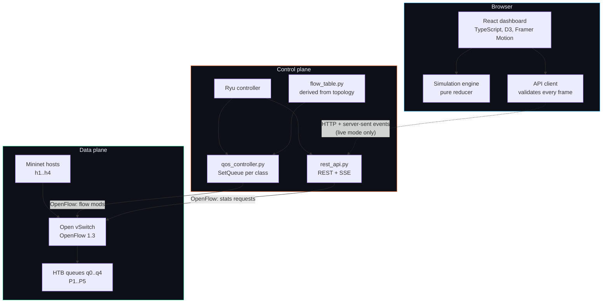
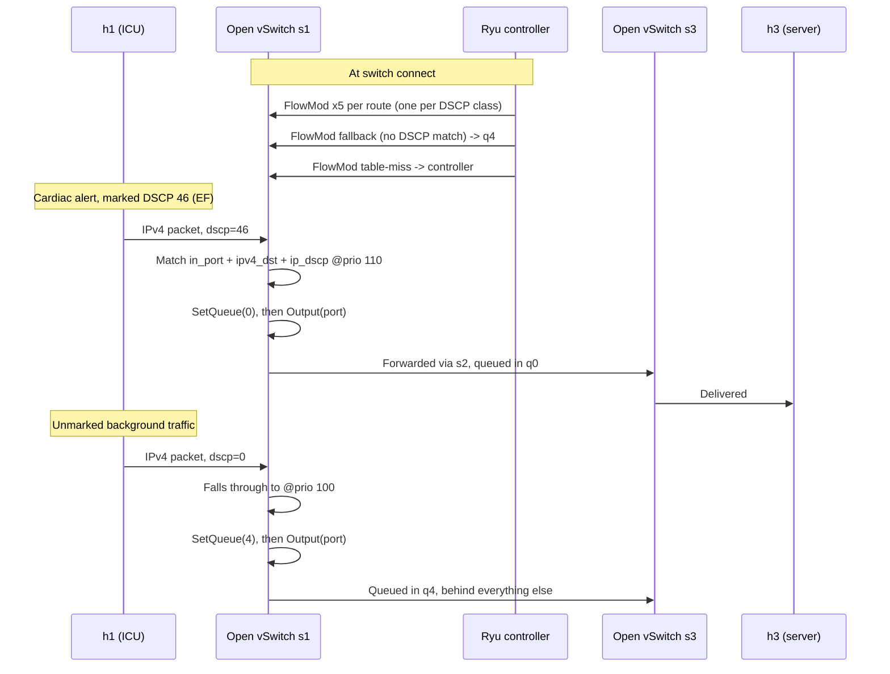
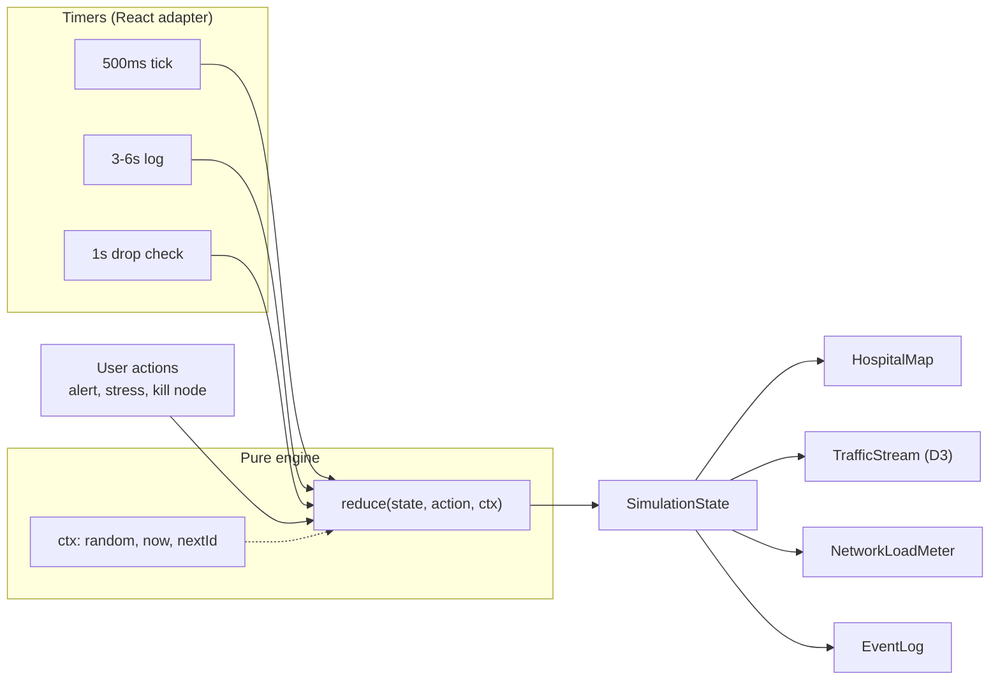

# Architecture

How LastMile is put together, and why. The reasoning matters more than the
diagrams — most of what follows is a record of trade-offs, including the ones
that went the other way.

---

## System overview



The dotted edge is the only link between the browser and the network, and it
is optional. The dashboard defaults to its own simulation, which is why the
deployed build works with nothing behind it.

---

## Repository map

```
lastmile/                     React dashboard
  src/simulation/
    constants.ts              departments, geometry, model parameters
    engine.ts                 pure reduce(state, action, ctx)
    useNetworkSimulation.ts   React adapter: timers, clock, state
    types.ts                  the domain, as closed unions
  src/api/                    controller client, live-mode hook
  src/components/             presentation only

SDN_files/                    Control plane
  topology.py                 hosts, switches, links, derived port map
  flow_table.py               forwarding rules, derived by shortest path
  qos.py                      traffic classes, DSCP marks, HTB rates
  static_controller.py        forwarding only
  qos_controller.py           forwarding + queue assignment
  rest_api.py                 REST + SSE for the dashboard
  setup_qos.py                creates the OVS queues
  benchmark.py                measurement run (Mininet, root)
  benchmark_stats.py          parsing and percentiles (pure)
  report_results.py           CSV -> README table
```

A pattern repeats: **pure module, then the layer that needs the world.**
`engine.ts` has no React; `flow_table.py` has no Ryu; `benchmark_stats.py` has
no Mininet; `api_model.py` has no sockets. That split is what lets 141 Python
and 80 TypeScript tests run in CI with no Open vSwitch, no kernel modules and
no root.

---

## Packet path with QoS



Two details that are easy to get wrong:

- **`SetQueue` must precede `Output`.** Actions in an `APPLY_ACTIONS` list
  execute in order; the queue has to be chosen before the packet reaches the
  port.
- **The fallback rule is not optional.** Without it, unmarked traffic hits
  table-miss and is punted to the controller. With it, unmarked traffic
  forwards normally but lands in best effort. Fail-open on reachability,
  fail-safe on priority.

---

## Dashboard state flow



Every nondeterministic input arrives through `ctx`, so a test can drive the
whole state machine with a fixed RNG and a frozen clock:

```ts
const ctx = createSimulationContext({ random: () => 0.5, now: () => 0 });
reduce(state, { type: 'TOGGLE_NODE', name: 'ICU' }, ctx);
```

---

## Design decisions

### Priority queuing rather than rate limiting

Rate limiting caps what background traffic may send. It is simpler, needs no
per-packet classification, and it is the wrong tool here.

A cap has to be set for the worst case, so it wastes capacity whenever the
network is quiet — a radiology transfer is throttled at 3am for no reason.
Worse, a cap does nothing about the *queue* a critical packet lands behind. If
background traffic is capped at 60% and the link is at 60%, the alert still
waits behind whatever is already buffered.

Strict priority queuing inverts both properties: background traffic uses the
whole link when nothing else wants it, and yields within one packet
transmission time when something does. The cost is per-packet classification
and the risk of starving lower classes, which is why every class keeps a
guaranteed floor rather than pure strict priority.

### DSCP marking rather than flow identification

The controller could classify by 5-tuple: match ICU's IP and the vitals port,
call it P2. That needs no cooperation from endpoints, which is a real
advantage.

It also needs the controller to know every application's addressing, and to be
updated whenever a device is replaced or a port changes. In a hospital, where
equipment is procured over decades from vendors who do not coordinate, that
table is wrong the day it is written.

DSCP moves the decision to the endpoint, which is the only party that knows
whether this particular packet is a cardiac alert or a routine reading. Six
bits, in a header field every switch already understands, settable with one
`setsockopt`. The cost is trust — see [Threat model](#threat-model).

### A central controller, not distributed configuration

Every switch could be configured with the same queue policy independently.
That works, and it is what a traditional network does.

The reason for a controller is not the initial configuration; it is
everything after. A single component with a global view can answer "is the
path from ICU to the server currently degraded", install a rule on every
switch atomically, and report what actually happened. Distributed
configuration can do none of those without a management system that is, in
effect, a controller.

The trade-off is a control-plane dependency. If the controller is unreachable,
already-installed flows keep forwarding — the data plane does not stop — but
nothing new can be programmed and nothing can be observed.

### Server-sent events, not WebSockets

The flow is entirely one-way: the controller reports, the browser displays.
SSE is plain HTTP, reconnects on its own, and needs no upgrade handshake to
negotiate through a lab proxy. WebSockets would add a bidirectional channel
nothing uses.

If the dashboard ever needs to *command* the controller — install a policy,
force a failover — that calculation changes.

### The simulation is not dead weight

It would be tidier to delete the browser simulation now that live data exists.
Keeping it is deliberate:

- The deployed build has no backend. Simulation is what makes a portfolio link
  worth clicking.
- It is the fallback when the controller is unreachable, and the UI says so
  rather than showing stale numbers.
- It is fully testable. 35 of the dashboard's tests drive the reducer directly
  with no DOM and no timers.

The rule enforced throughout is that the *source is always on screen*.
Simulated figures shown without qualification are how this project's original
performance claims became misleading.

### Deriving the flow table rather than writing it

The forwarding rules were twenty hand-maintained literals. Every port number
was transcribed by hand, so a single wrong digit produced a blackhole that
surfaced only as a failed ping, and any topology change meant re-deriving all
of them mentally.

They are now computed from `topology.py` by breadth-first shortest path. The
derivation reproduces all twenty original rules exactly, and a test pins that
so the refactor could not silently change forwarding behaviour against which
the captured evidence was produced.

### Nearest-rank percentiles, and p99 over the mean

The claim this project makes is about the worst case delivery of a critical
alert. A mean hides exactly the tail that matters: a stream can average 12 ms
and still strand one alert at 400 ms, and it is the late one that has clinical
consequences.

Percentiles are nearest-rank rather than interpolated. At the sample counts a
benchmark run produces, interpolation invents values that were never observed,
and a tail-latency claim should rest on a measurement that actually happened.

---

## What breaks at scale

This is a four-host, three-switch demonstration. Honest extrapolation:

| Concern | At this size | At hospital scale | What would have to change |
|---|---|---|---|
| **Flow table** | 120 rules per switch (20 routes × 5 classes + fallback) | Rules grow with hosts × classes and would exhaust switch TCAM | Match on destination subnet rather than host; push classification to the edge and keep the core class-only |
| **Controller** | One process, one topology | Single point of failure for the control plane | Ryu clustering, or a controller that supports OpenFlow roles (master/slave/equal) |
| **Statistics polling** | Every switch, every second | Polling cost grows linearly; a campus fabric would swamp the controller | Push-based counters, sampled telemetry, or per-switch aggregation |
| **Topology** | Static, hardcoded line | Real networks re-converge constantly | LLDP discovery and dynamic path computation |
| **Queue configuration** | `ovs-vsctl` per port, applied by script | Hundreds of ports, mixed vendors | Vendor-neutral config (OF-CONFIG, NETCONF/YANG) or an orchestrator |
| **Failure model** | Kill a node in the UI | Link flap, switch reboot, partition, controller loss | Fast-failover groups, `BFD`, and a decision about data-plane behaviour when the controller is gone |
| **Trust** | Every endpoint is cooperative | Compromised or misconfigured devices | Marking policed at the edge — see below |

---

## Threat model

<!-- Expanded in the Limitations section of the root README. -->

Classification is only as trustworthy as the endpoints that do it. The
significant consequences:

**Any host can mark its traffic P1.** `setsockopt(IP_TOS, 0xB8)` is one line
and needs no privileges on most systems. A compromised workstation, or a badly
configured one, can place its bulk transfer in the same queue as a cardiac
alert. The guaranteed floors mean it cannot starve other classes entirely, but
it can degrade the class that matters most.

The mitigation, not implemented here, is to police marking at the network
edge: remark or drop DSCP values arriving on ports that are not authorised to
use them, so trust is enforced where the device attaches rather than assumed
everywhere.

**The REST API has no authentication and permissive CORS.** It is read-only,
which limits the exposure to information disclosure — topology, counters,
policy. That is acceptable for a read-only endpoint on an isolated lab
network, and would not be acceptable on a hospital network or if the API ever
accepted writes. Anything that installs flows needs authentication,
authorisation and an audit trail, because it can black-hole clinical traffic.

**The controller is unauthenticated to the switches.** OpenFlow here runs over
plain TCP on 6633. Anyone who can reach that port can present as a switch or
observe control traffic. Production OpenFlow should use TLS with mutual
certificate authentication.

**Denial of service against the control plane.** Table-miss punts unmatched
packets to the controller. A host generating unmatched traffic can drive
control-plane load without limit. Real deployments rate-limit `packet-in` and
install a low-priority drop rather than a punt.

---

## Reading order

For someone new to the codebase:

1. `SDN_files/topology.py` — the network, as data
2. `SDN_files/flow_table.py` — how forwarding is derived from it
3. `SDN_files/qos.py` — the priority model, as data
4. `SDN_files/qos_controller.py` — where the two meet OpenFlow
5. `lastmile/src/simulation/engine.ts` — the dashboard's state machine
6. `lastmile/src/api/client.ts` — the boundary between them

Tests are the second-best documentation in this repository, and in a few
places the best: `SDN_files/tests/test_flow_table.py` walks the forwarding
table exactly as a packet would, and reads as a specification of what the
network is supposed to do.
